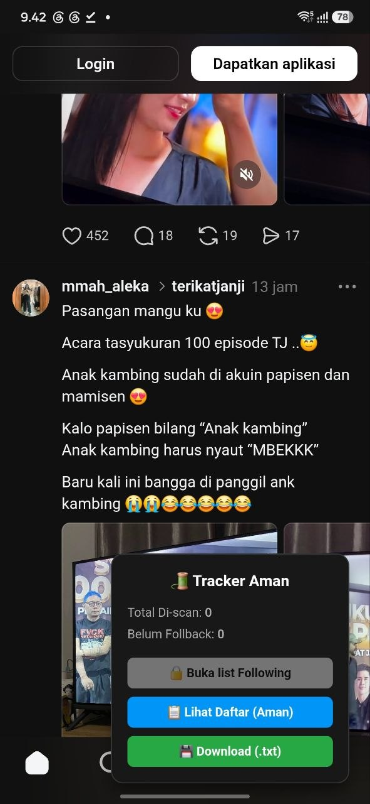

# Threads Tracker Extension

Chrome Extension untuk membantu melihat akun **Threads yang belum melakukan follow back (Non Mutual)** secara langsung di halaman Threads.

Extension akan muncul otomatis saat Anda membuka Threads dan menampilkan daftar akun yang Anda follow tetapi belum mengikuti Anda kembali.

---

## ✨ Fitur

- Menampilkan daftar akun **Non Mutual** secara otomatis.
- Tidak perlu membuka popup atau menu extension.
- Berjalan langsung di halaman Threads.
- Menggunakan sesi login Threads yang sudah ada.
- Mendukung browser desktop dan Android (Quetta Browser).

---

# Instalasi (Desktop)

## 1. Download Extension

Buka halaman **Releases** dan download file ZIP terbaru:

https://github.com/dhohirpradana/threads-tracker/releases

Ekstrak file ZIP hingga muncul folder:

```
dist/
```

---

## 2. Buka Halaman Extension Chrome

Buka:

```
chrome://extensions/
```

Lalu aktifkan **Developer mode**.

---

## 3. Install Extension

Klik **Load unpacked**.

Pilih folder:

```
dist/
```

Jika berhasil, Threads Tracker akan muncul pada daftar Extensions.

---

# Instalasi (Android)

Extension juga dapat digunakan melalui **Quetta Browser**.

https://play.google.com/store/apps/details?id=net.quetta.browser&hl=id

## 1. Install Quetta Browser

Download dan install **Quetta Browser** dari Google Play Store.

---

## 2. Login ke Threads

Buka Quetta Browser, kemudian login ke akun Threads Anda.

---

## 3. Download Extension

Download file ZIP terbaru dari halaman Releases:

https://github.com/dhohirpradana/threads-tracker/releases

---

## 4. Load Extension

Masuk ke menu **Extensions** di Quetta Browser, lalu pilih **Load Extension** (atau **Load Unpacked**, tergantung versi).

Pilih folder hasil ekstrak ZIP (`dist`).

### Tampilan Quetta Browser

<p align="center">
  
</p>

---

## 5. Refresh Threads

Buka atau refresh halaman Threads.

Extension akan berjalan otomatis dan menampilkan daftar akun yang **belum mengikuti Anda kembali (Non Mutual)**.

---

# Cara Menggunakan

1. Login ke akun Threads.
2. Buka:

```
https://www.threads.com
```

3. Refresh halaman jika extension baru saja dipasang.

4. Tunggu beberapa saat hingga proses selesai.

Extension akan membaca data Following dan Followers, kemudian hanya menampilkan akun yang belum mengikuti Anda kembali.

---

# Update Extension

Jika terdapat versi terbaru:

1. Download ZIP terbaru dari halaman Releases.
2. Ganti folder extension yang lama.
3. Reload extension pada browser.

---

# Troubleshooting

### Panel tidak muncul

- Pastikan extension sudah aktif.
- Refresh halaman Threads.
- Pastikan sudah login ke Threads.

---

### Data belum muncul

Proses membutuhkan waktu beberapa saat, terutama jika jumlah Following cukup banyak.

---

### Data tidak lengkap

Kemungkinan disebabkan oleh:

- Koneksi internet tidak stabil.
- Threads belum selesai memuat seluruh daftar akun.
- Halaman ditutup sebelum proses selesai.

---

# Keamanan

Extension ini:

- ✅ Tidak meminta username atau password.
- ✅ Tidak mengirim data ke server eksternal.
- ✅ Berjalan sepenuhnya di browser Anda.
- ✅ Menggunakan sesi login Threads yang sudah aktif.

---

# Download

Releases:

https://github.com/dhohirpradana/threads-tracker/releases

Repository:

https://github.com/dhohirpradana/threads-tracker

---

Semoga extension ini membantu Anda mengelola daftar Following dengan lebih mudah.